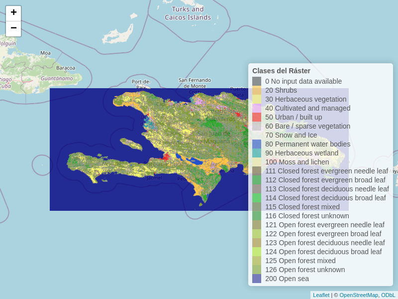

```{r setup, include=FALSE}
knitr::opts_chunk$set(
  echo = TRUE,
  warning = FALSE,
  message = FALSE,
  out.width = '100%',
  fig.retina = 4)
```

```{r, include=F}
output_format <- knitr::opts_knit$get("rmarkdown.pandoc.to")
repo_url <- system("git config --get remote.origin.url", intern = TRUE)
repo_name <- sub(".git$", "", basename(repo_url))
org_name <- basename(dirname(repo_url))
rmd_filename <- tools::file_path_sans_ext(basename(knitr::current_input()))
github_pages_url <- paste0("https://", org_name, ".github.io/", repo_name, "/", rmd_filename, ".html")
```

```{r, results='asis', echo=F}
if (grepl('gfm', output_format)) {
  cat('Versión HTML (quizá más legible), [aquí](', github_pages_url, ')\n', sep = '')
} else if (output_format == 'latex') {
  cat('Versión HTML (quizá más legible), [aquí](', github_pages_url, ')\n', sep = '')
}
```

# Fecha/hora de entrega

**25 de septiembre de 2024, 11:59 pm.**


# Introducción

## "Plantilla geográfica", medio físico, variables ambientales, correlación, regresión

En el contexto de esta asignatura, puedes asumir que estos nombres se refieren a lo mismo: "plantilla geográfica", medio físico, variables ambientales. Todo ecosistema tiene una "parte dura" (que puede ser relativamente estática o dinámica) sobre o dentro de la cual ocurren las interacciones entre especies que conforman nuestra comunidad ecológica. Todos los lugares del planeta disponen, en la actualidad, de alguna forma de información. El objetivo es poder reunir variables de esa "parte dura", y organizarlas en una forma matricial, donde las filas sean "sitios" y las columnas sean "variables"; a este producto le llamaremos "matriz ambiental".

Dado que es común que las variables ambientales se correlacionen entre sí, en este ejercicio también es importante identificar la magnitud y dirección de estas correlaciones, ya que pueden influir en la interpretación de los datos y en los resultados de los análisis posteriores. Por ejemplo, una alta correlación entre variables puede indicar redundancia, lo que significa que estas variables están capturando información similar sobre el medio físico. Esto puede llevar a problemas como la multicolinealidad en modelos de regresión, lo que afecta la estabilidad de los coeficientes estimados y su interpretación. Por tanto, evaluar la correlación entre variables es un paso clave para decidir cuáles deben ser incluidas en un análisis más profundo y cuáles pueden ser excluidas o transformadas para mejorar la robustez del modelo.

En cuanto a la forma de almacenar los datos sobre variables ambientales, remarco lo estrictamente necesario que debes saber sobre los modelos de datos en información geográfica. Aunque también hay información en el modelo de datos vectorial, la mayor parte de la información del medio físico disponible en repositorios globales de información geoespacial (uno que centraliza mucha información es Google Earth Engine, pero hay varios), se encuentra almacenadas en archivos del modelo de datos ráster. En el caso más simple, un ráster es una matriz de $n$ filas por $m$ columnas, que forman celdas distribuidas de forma regular siguiendo un sistema de coordenadas de referencia, donde cada celda representa el valor de una variable sobre el territorio. Una realización muy popular de los rásters son las "fotos" que capturas con un móvil. No obstante, los rásters que informan sobre el medio físico pueden complicarse "todo lo que queramos". **En un ráster, sólo se almacenan valores numéricos, pero la variable representada puede ser cualitativa o cuantitativa**.

Si la variable es cuantitativa, los valores en el ráster se almacenarán de acuerdo a un factor de escala y a un *offset* o desplazamiento. Por ejemplo, supongamos que tienes un valor de temperatura para la capa bioclimática **bio1 (mean annual air temperature)** o **temperatura media anual del aire**, y deseas interpretarlo correctamente en °C.

>**Ejemplo:**
>
>Supón que el valor registrado para un punto en la capa bioclimática **bio1** es **2900**.
>
>1. **Unidad y factor de escala:** El factor de escala es **0.1**, lo que significa que el valor debe multiplicarse por **0.1** para obtener la temperatura en Kelvin. 
   - 2900 × 0.1 = 290 Kelvin
>
>2. **Offset, ajuste o desplazamiento:** Según la tabla, el *offset* es **-273.15**, lo cual convierte el valor de Kelvin a grados Celsius.
   - 290 Kelvin - 273.15 = 16.85 °C
>
>**Interpretación:** El valor final, **16.85 °C**, representa la temperatura media anual del aire para ese punto geográfico, calculada como el promedio diario a lo largo de un año.
>

Por otro lado , si la variable es cualitativa, el ráster de todas formas almacenará valores numéricos, que son realmente códigos representados por enteros positivos (números naturales). En este caso, dispondrás de una tabla de equivalencias para determinar a qué clase corresponde cada código.

## Fuentes disponibles para este ejercicio

La mayor parte de las fuentes de este ejercicio son ráster. El único vectorial es un límite de tierra firme de República Dominicana, de GADM (investiga qué es GADM). El resto son rásters casi todos recortados para el territorio emergido de República Dominicana.

Todos los archivos se localizan en el directorio `compartidos`, subdirectorio `geo131-pa05` en tu cuenta del servidor RStudio.

¿Qué significan los valores en las celdas de cada ráster? Tres *dataset*, `CGIAR-ELEVACION`, `CHELSA*` (este es un conjunto de archivos) y `YINSOLTIME*`, representan variables cuantitativas medidas en números reales. Los otros dos conjuntos, `PROBAV*` y `G90-GEOMORFONOS`, representan variables cualitativas medidas nominalmente. Desde el repositorio [Estadística zonal multipropósito sobre información geoespacial de República Dominicana, usando Google Earth Engine, Python y R](https://github.com/geofis/zonal-statistics) [@jose_ramon_martinez_batlle_2022_7367180] podrás enlazar con las fuentes bibliográficas de cada una de las variables usadas en esta práctica. A continuación te dejo enlaces a notas específicas de estas fuentes:

  - `CGIAR-ELEVACION.tif`. **RÁSTER CUANTITATIVO**. El nombre es bastante explícito. Datos de elevación (huecos rellenos), de la Misión Topográfica del Transbordador Shuttle (SRTM) para el globo, versión 4, de la base de datos del CGIAR-CS.
  
  - `CHELSA*.tif`. **RÁSTERS CUANTITATIVOS**. Se compone de 19 rásters individuales, correspondientes a igual número de variables bioclimáticas que podrás consultar en la tabla 7.1 de la página 11 de [este PDF](https://chelsa-climate.org/wp-admin/download-page/CHELSA_tech_specification_V2.pdf). En la tabla, también podrás consultar el factor de escala y el desplazamiento que deberás aplicar para obtener sus valores en las unidades correspondientes.

  - `PROBAV*.tif`. **RÁSTERS CUALITATIVOS**. Cinco rásters de cobertura del suelo del programa Copernicus, cada uno correspondiente a un año entre 2015 y 2019. Consulta la leyenda de la tabla 4 de [este PDF](https://zenodo.org/records/4723921/files/CGLOPS1_PUM_LC100m-V3_I3.4.pdf?download=1)

  - `G90-GEOMORFONOS.tif`. **RÁSTER CUALITATIVO**. "Geomórfonos" del conjunto de datos "Geomorpho90m", que son un conjunto de elementos morfológicos generales obtenidos a partir de aplicar algoritmos de vecindad a un modelo digital de elevaciones. [Esta es la fuente original](https://doi.pangaea.de/10.1594/PANGAEA.899135), y fue producida con el addon de GRASS GIS [`r.geomorphon`](https://grass.osgeo.org/grass84/manuals/r.geomorphon.html), donde podrás consultar la leyenda (esto último, muy importante). Una leyenda alternativa en español es esta:
  
```{r, echo=F}
library(tidyverse)
read.table("~/compartidos/geo131-pa05/G90-GEOMORFONOS.clr", header = FALSE) %>% 
  select(-(2:5)) %>% 
  rename(Código = V1, Morfología = V6) %>% 
  knitr::kable(align = 'c')
```

  - `G90-PENDIENTE.tif`. **RÁSTER CUANTITATIVO**. El nombre es bastante explícito. Datos de pendiente (en grados), generados a partir del modelo digital de elevaciones de la Misión Topográfica del Transbordador Shuttle (SRTM) para el globo.
  
  - `YINSOLTIME_horas_insolacion_topografica.tif`. **RÁSTER CUANTITATIVO**. Horas de insolación anuales de manera directa, donde el factor de escala es 1 y el *offset* es 0. Usando el modelo digital de elevaciones CGIAR, también citado en el repo de estadística zonal [@jose_ramon_martinez_batlle_2022_7367180], se estimaron las horas de insolación directa por año, condicionadas por la topografía. Para esto, se utilizó el [complemento `r.sun` de GRASS GIS](https://grass.osgeo.org/grass84/manuals/r.sun.html).

```{r fuentes, eval=F, results='asis', echo=F, message=F, warning=F}
library(kableExtra)
library(dplyr)
tabla_fuentes <- readODS::read_ods('tabla-de-fuentes.ods')
tabla_fuentes %>% 
  filter(grepl('PROBA|CHELSA|insolación|CGIAR|G90', Descripción)) %>% 
  mutate(across(everything(), ~ ifelse(is.na(.x), '', .x))) %>%
  mutate(across(everything(), ~ gsub('(\\*)(.*)(\\*)', '<i>\\2</i>', .x))) %>% 
  mutate(across(everything(),
                ~ ifelse(.x=='No disponible', 'No disponible',
                         gsubfn::gsubfn(
                           '(http.*?)(\\s|$|\\))',
                           ~ paste0("<a href=\"", x,"\">", substr(gsub('http.*?//', '', x), 1, 25), "... </a>", y), 
                              .x)))) %>%
  kable(format = 'html', escape = F, booktabs = T,
        caption = 'Fuentes') %>%
  kable_styling(bootstrap_options = c("hover", "condensed"), full_width = T) %>%
  column_spec(column = c(2, 8), width_min = '4in') %>% 
  column_spec(column = c(1,3:7), width_min ='2in', width_max = '4in')
```


```{r}
tipos_var <- data.frame(
  Fuente = list.files('~/compartidos/geo131-pa05', pattern = '*tif', full.names = T)) %>% 
  mutate(Fuente = gsub('/home/jose', '~', Fuente)) %>% 
  mutate(Tipo = ifelse(grepl('PROBA|G90-GEOM', Fuente), 'Cualitativa', 'Cuantitativa'))
tipos_var %>% 
  knitr::kable()
```

Con fines demostrativos, voy a representar un mapa de coberturas con `R` usando la fuente de PROBA-V. Primero cargaré paquetes, y luego haré la correspondiente representación. Puedes usar el código a continuación en un *script* de R para visualizar esta fuente.

> No tienes obligación de ejecutar este bloque código y el siguiente para representar el mapa. Sólo tiene fines demostrativos para mostrarte las capacidades de `leaflet`, una biblioteca muy útil para mapas interactivos.

```{r}
library(tidyverse)
library(leaflet)
library(leaflet.extras)
library(webshot2)
library(htmlwidgets)
library(raster)
library(kableExtra)
library(sf)
```

A continuación representaré el mapa (si estás viendo la versión HTML del documento, podrás interactuar con el mapa).

```{r}
# Leer el archivo CLR
clr_data <- read.table("~/compartidos/geo131-pa05/PROBAV_2015.clr", header = FALSE)

# Extraer los valores, colores y nombres de clase
clase_valores <- clr_data$V1
colores_rgb <- rgb(clr_data$V2, clr_data$V3, clr_data$V4, maxColorValue = 255)
nombres_clases <- clr_data$V6

# Crear una paleta de colores personalizada basada en el CLR
paleta_colores <- colorFactor(palette = colores_rgb, domain = clase_valores)

# Cargar el archivo ráster
raster_archivo <- raster("~/compartidos/geo131-pa05/PROBAV_2015.tif")

# Verifica que los valores del ráster coincidan con los valores de clase del CLR
# print(unique(values(raster_archivo)))

# Crear un mapa de Leaflet con el ráster
mapa <- leaflet() %>%
  addTiles() %>%
  addRasterImage(raster_archivo, colors = paleta_colores, opacity = 0.8) %>%
  addLegend(position = "bottomright", 
            pal = paleta_colores, 
            values = clase_valores, 
            labFormat = labelFormat(transform = function(x) nombres_clases[match(x, clase_valores)]),
            title = "Clases del Ráster")


# Evaluar el formato de salida y tomar acción en función de él
if (grepl('gfm', output_format)) {
  # Si la salida es Markdown (GitHub-Flavored Markdown), guarda el mapa como HTML temporalmente
  html_file <- tempfile(fileext = ".html")
  saveWidget(mapa, file = html_file, selfcontained = TRUE)
  
  # Toma una captura del archivo HTML
  webshot2::webshot(url = html_file, file = 'mapa-demo.png', vwidth = 800, vheight = 600)
  
  # Incluye la imagen capturada en el documento
  
} else {
  # Si la salida es HTML, imprime el objeto mapa normalmente
  mapa
}


```

# Instrucciones generales que aplican a todos los ejercicios.

1. **La instrucción más importante: tu práctica me la entregarás en papel fotografiado (es preferible un PDF con todas las páginas juntas, hay aplicaciones móviles para esto) y me la puedes enviar por mensaje directo a través del foro. `R` sólo lo usarás para hacer cálculos.**

2. Como se supone que esta práctica está pensada para hacerse en el aula, el servidor sólo será un apoyo, y deberías poder operarlo desde el teléfono. Por esta razón, la he diseñado de manera que sólo tengas que copiar código desde este cuaderno y pegarlo en un script de R (en el servidor, `File>New>R Script`). NO tienes que crear un proyecto de RStudio. Si hay algún proyecto abierto al momento de comenzar la práctica, ciérralo (`File>Close Project`). En el código que dejo de ayuda en cada ejercicio, tendrás que cambiar sólo algunas partes; busca siempre la indicación `#<-----Atender aquí`.

3. Al final de cada ejercicio, debes escribir, a mano, un párrafo de mínimo cuatro oraciones, explicando por qué hiciste lo que hiciste (oración 1), cómo lo hiciste (oración 2), qué obtuviste (oración 3) y qué interpretas (oración 4).

4. Elige un número entero entre el 2 y el 20 (anúncialo en el foro, para evitar duplicidad; el 1 se lo reserva el tali), para los ejercicios de aleatorización, el cual asignarás al objeto `mi_aleatorizacion`.

```{r, echo=F, include=F}
mi_aleatorizacion <-  1
```

```{r, eval=F}
mi_aleatorizacion <-  #<-----Atender aquí
```

5. Carga estos paquetes. Si te aparecen errores sobre que esta o aquella función no fue encontrada, o que el operador "%>%" no fue encontrado, carga estas funciones.

```{r}
library(sf)
library(raster)
library(tidyverse)
library(leaflet)
library(leaflet.extras)
library(webshot2)
library(htmlwidgets)
library(raster)
library(kableExtra)
```


# Ejercicio 1. Genera puntos aleatorios

Primero genera tus 10 puntos aleatorios.

```{r}
# Generar 10 puntos aleatorios dentro del polígono de República Dominicana
rd <- st_read('~/compartidos/geo131-pa05/RD_GADM.gpkg', quiet = T) # Investiga qué es GADM
# Para asegurar reproducibilidad. Seleccionar desde "{" hasta "}", ambas inclusive, y ejecutar
{set.seed(mi_aleatorizacion)
  puntos <- st_as_sf(st_sample(rd, size = 10, type = "random"))}

```

Coloca en una tabla como la de abajo, las coordenadas de longitud y latitud de cada punto en grados decimales (e.g. 19.1223); no olvides el signo de la coordenada. Para simplificar los cálculos, redondea a 4 posiciones decimales (la precisión posicional es ~10 metros).

| Punto | Longitud | Latitud  |
| :---: | :------: | :-----:  |
|Punto 1|  xx.xxxx |  xx.xxxx |

Para generar dicha tabla, puedes usar el siguiente bloque de código:

```{r, eval=F}
puntos %>%
  mutate(Punto = paste('Punto', 1:nrow(puntos)),
         Longitud = round(st_coordinates(x)[,1], 4),
         Latitud = round(st_coordinates(x)[,2], 4)) %>%
  st_drop_geometry() %>% 
  as.data.frame() %>% 
  knitr::kable(align = 'c')

```

Por ejemplo, los puntos asignados al tali se verían así en la tabla:

```{r, echo=F}
puntos %>%
  mutate(Punto = paste('Punto', 1:nrow(puntos)),
         Longitud = round(st_coordinates(x)[,1], 4),
         Latitud = round(st_coordinates(x)[,2], 4)) %>%
  st_drop_geometry() %>% 
  as.data.frame() %>% 
  knitr::kable(align = 'c')
```

Ahora representa tus puntos con estas líneas de abajo. Justo debajo del bloque de código, verás el mapa de los puntos del tali. Si la distribución de tus puntos se parece a la de los del tali, algo anda mal, pues no deberían coincidir. 
> Representa tus puntos en papel usando tu mapa, dibujando la silueta de RD; la precisión posicional no es un requisito.

```{r}
plot(rd %>% st_as_sfc()) # Representar el vectorial de RD
plot(puntos, add = T) # Para representar tus puntos
```

> No olvides tu párrafo al final del ejercicio.

# Ejercicio 2. Extrae los valores para varios rásters

Se te asignan cinco variables cuantitativas, según tu número elegido. Usa este código para generarlas.

```{r, eval=F}
{set.seed(mi_aleatorizacion)
  fuentes_cuan_sel <- c(
    sample(tipos_var[grepl('G90-PE|CGIAR|YINS', tipos_var$Fuente), 'Fuente'], 2),
    sample(tipos_var[grepl('CHELSA', tipos_var$Fuente), 'Fuente'], 3))}
cat('Estos fueron mis archivos seleccionados', fuentes_cuan_sel, sep = '\n')

```

Por ejemplo, al tali le salieron estas variables (si te salieron las mismas, algo anda mal):

```{r, echo=F}
{set.seed(mi_aleatorizacion)
  fuentes_cuan_sel <- c(
    sample(tipos_var[grepl('G90-PE|CGIAR|YINS', tipos_var$Fuente), 'Fuente'], 2),
    sample(tipos_var[grepl('CHELSA', tipos_var$Fuente), 'Fuente'], 3))}
cat('Estos fueron mis archivos seleccionados', fuentes_cuan_sel, sep = '\n')

```

Usando tus puntos creados en el ejercicio anterior, extrae los valores correspondientes de cada ráster para cada uno de tus 10 puntos. Con el código de abajo lo podrás hacer. NECESARIO: investiga sobre las funciones `*apply` y los bucles `for`; te mostraré cómo extraer hacer la extracción de valores desde tus cinco ráster de manera masiva, tanto con `*apply` como con bucle `for`.

- Con `sapply`, que forma parte de la familia de los `*apply`:

```{r}
df_valores_cuan_sel_sapply <- sapply(
  fuentes_cuan_sel,
  function(archivo) {
    r_i <- raster(archivo)
    raster::extract(x = r_i, y = puntos)
  }) %>%
  as.data.frame %>% 
  setNames(gsub('.tif', '', basename(fuentes_cuan_sel)))

```

- Con bucle `for`, deberías obtener el mismo resultado. Usar bucle `for` es más compatible con los bloques de control de flujo de otros lenguajes de programación:

```{r}
# Inicializa una lista vacía para almacenar los data.frames
df_resultados <- list()
# Itera sobre los elementos de `fuentes_cuan_sel`
for (archivo in fuentes_cuan_sel) {
  # Carga el ráster
  r_a <- raster(archivo)
  # Extrae los valores y los convierte en un data.frame
  v <- raster::extract(x = r_a, y = puntos)
  # Agrega el data.frame a la lista
  df_resultados[[archivo]] <- v
  }
df_valores_cuan_sel_for <- df_resultados %>%
  as.data.frame %>%
  setNames(gsub('.tif', '', basename(fuentes_cuan_sel)))

```

Comprueba que tus resultados con la función `sapply` y con `for`, son idénticos.

```{r, eval=F}
all.equal(df_valores_cuan_sel_sapply, df_valores_cuan_sel_for)
```

Los valores extraídos desde los cinco rásters asignados al tali para sus cinco puntos asignados, se verían así (si los tuyos coinciden con estos, algo anda mal):

```{r, echo=F}
df_valores_cuan_sel_for %>% 
  knitr::kable(align = 'c', digits = 2)
```

Ahora es necesario convertir los valores de las variables del conjunto CHELSA, dado que usan factor de escala y, algunas también tienen *offset*. Aplicando este código, podrás lograrlo

```{r}
vars_offset <- paste0('_bio', c(1,5:6, 8:11), '_')
escala <- 0.1
offset <- -273.15
df_valores_cuan_sel_reales <- df_valores_cuan_sel_sapply %>%
  mutate(
    # Aplica la escala de 0.1 a todas las columnas que contienen "bio" y un número
    across(matches("bio\\d+"), ~ . * 0.1),
    
    # Aplica el offset de -273.15 solo a las columnas cuyo nombre contiene alguna de las cadenas en `vars_offset`
    across(matches(paste(vars_offset, collapse = "|")), ~ . - 273.15))
```

Los valores extraídos desde los cinco rásters asignados al tali para sus cinco puntos asignados, luego de aplicar el escalado y el *offset*, se verían así:

```{r, echo=F}
df_valores_cuan_sel_reales %>% 
  knitr::kable(align = 'c', digits = 2)
```

> Transcribe tu tabla a papel.

> No olvides tu párrafo al final del ejercicio.

# Ejercicio 3. Construye una matriz de correlación y calcula el coeficiente de correlación

Construye una matriz de correlación usando el código que se muestra abajo. Redondea el coeficiente (o índice) de correlación de Pearson a tres cifras significativas para simplificar.

```{r}
# Calcula la matriz de correlación
correlacion <- cor(df_valores_cuan_sel_reales)

# Crea una matriz de NA con las mismas dimensiones que la matriz de correlación
correlacion_inferior <- correlacion

# Establece los valores del triángulo superior a NA
correlacion_inferior[upper.tri(correlacion_inferior, diag = T)] <- NA
correlacion_inferior <- round(correlacion_inferior, 3)
correlacion_inferior[is.na(correlacion_inferior)] <- ""

```

Así se vería la matriz de correlación del tali:

```{r}
# Muestra la matriz con solo el triángulo inferior
correlacion_inferior %>% knitr::kable()
```

> Transcribe tu matriz de correlación a papel.

Ahora reproduce, con cálculos manuales (en papel, papelito, papelito, "♪...me tumba con papelito...♪"), el valor del coeficiente de correlación de Pearson obtenido para el par de variables que obtuvo mayor valor absoluto. Por ejemplo, el valor absoluto de un coeficiente de correlación -0.98 es mayor que +0.92.

En el caso del tali, esta parte del ejercicio se haría con las variables `CHELSA_bio1_1981-2010_V21` y `CGIAR-ELEVACION`. Estos serían los vectores:

1. **CHELSA_bio1_1981-2010_V21**:
   - 15.05, 26.05, 25.95, 25.75, 22.65, 24.95, 21.95, 24.65, 24.45, 24.35

2. **CGIAR-ELEVACION**:
   - 1948.86, 42.51, 89.28, 19.13, 654.14, 231.23, 622.91, 238.35, 287.03, 427.51

> Nota. Cometí el error de elegir estas dos variables, cuando realmente debí elegir `CHELSA_bio1_1981-2010_V21` y `CHELSA_bio10_1981-2010_V21`, que tienen la correlación con el mayor valor abosluto. Para evitar transformar las demostraciones sensiblemente, dado que ya hay personas elaborando la práctica, no cambiaré la selección de variables, y valga esta nota como fe de erratas. Gracias a Sebatian Bocio por apuntar el error.

A continuación incluyo una demostración de cómo calcular el coeficiente de correlación de Pearson son esos vectores.

## Fórmula del Coeficiente de Correlación de Pearson

La fórmula para el coeficiente de correlación de Pearson (\( r \)) es:

\[
r = \frac{\sum (X_i - \overline{X})(Y_i - \overline{Y})}{\sqrt{\sum (X_i - \overline{X})^2 \sum (Y_i - \overline{Y})^2}}
\]

donde:

- \( X_i \) y \( Y_i \) son los valores individuales de los vectores.
- \( \overline{X} \) y \( \overline{Y} \) son las medias de los vectores \( X \) y \( Y \), respectivamente.

## Pasos de Cálculo

1. **Calcular las medias de los vectores** (\( \overline{X} \) y \( \overline{Y} \)):

 \[
 \overline{X} = \frac{15.05 + 26.05 + \ldots + 24.35}{10}
 \]

   \[
   \overline{X} = 23.28
   \]

   \[
   \overline{Y} = \frac{1948.86 + 42.51 + \ldots + 427.51}{10}
   \]

   \[
   \overline{Y} = 456.89
   \]

2. **Calcular las desviaciones de cada valor respecto a sus medias**:

   Ejemplo para el primer valor:
   
   \[
   (X_1 - \overline{X}) = 15.05 - 23.28 = -8.23
   \]

   \[
   (Y_1 - \overline{Y}) = 1948.86 - 456.89 = 1491.97
   \]

   Repite este cálculo para cada par de valores.

3. **Calcular los productos de las desviaciones** \((X_i - \overline{X})(Y_i - \overline{Y})\):

   Para el primer valor:

   \[
   (-8.23) \times (1491.97) = -12272.89
   \]

   Repite este cálculo para todos los pares y luego suma los resultados.

4. **Calcular los cuadrados de las desviaciones y sumarlos**:

   Para \( X \):

   \[
   (X_1 - \overline{X})^2 = (-8.23)^2 = 67.74
   \]

   Para \( Y \):

   \[
   (Y_1 - \overline{Y})^2 = (1491.97)^2 = 2225812.68
   \]

   Repite y suma los valores para ambos vectores.

5. **Retomando la fórmula del coeficiente de correlación de Pearson**:

   \[
   r = \frac{\sum (X_i - \overline{X})(Y_i - \overline{Y})}{\sqrt{\sum (X_i - \overline{X})^2 \sum (Y_i - \overline{Y})^2}}
   \]

6. Tenemos los siguientes valores calculados y sustituimos en la fórmula.

- **Media de X (\(\overline{X}\))**: \( 23.58 \)
- **Media de Y (\(\overline{Y}\))**: \( 456.09 \)
- **Suma de los productos de las desviaciones**: \( \sum (X_i - \overline{X})(Y_i - \overline{Y}) = -16738.65 \)
- **Suma de los cuadrados de las desviaciones de X**: \( \sum (X_i - \overline{X})^2 = 97.08 \)
- **Suma de los cuadrados de las desviaciones de Y**: \( \sum (Y_i - \overline{Y})^2 = 2919317.85 \)

\[
r = \frac{-16738.65}{\sqrt{97.08 \times 2919317.85}}
\]

\[
r = \frac{-16738.65}{\sqrt{283445690.61}}
\]

\[
r = \frac{-16738.65}{16832.92}
\]

\[
r = -0.994
\]

El coeficiente de correlación de Pearson (\( r \)) es aproximadamente **-0.994**, lo que indica una relación lineal negativa muy fuerte entre los dos conjuntos de datos. El valor es parecido al obtenido por la función `cor`, -0.996.

> No olvides tu párrafo al final del ejercicio.

# Ejercicio 4. Representa tus variables

Representa tu par de variables con mayor valor absoluto del coeficiente de correlación de Pearson en un gráfico de dispersión dibujado a mano.

El ejercicio, aplicado al caso del tali, se muestra a continuación.

Puedes usar los bloques de código de abajo, sustituyendo por tus variables, para asistirte en el dibujo. Los nombres las columnas en el `data.frame` los podrás elegir desde el desplegable que aparece al presionar la tecla `TAB` luego de escribir el nombre del `data.frame` en la consola de R)

```{r}
var1 <- df_valores_cuan_sel_reales$`CGIAR-ELEVACION` #<-----Atender aquí
var2 <- df_valores_cuan_sel_reales$`CHELSA_bio1_1981-2010_V21` #<-----Atender aquí
```

En el caso del tali, el gráfico de dispersión sería este. 

```{r}
plot(var1, var2)
abline(lm(var2 ~ var1), col = 'red')
```

> Dibuja tu gráfico en papel.

> No olvides tu párrafo al final del ejercicio.

# Ejercicio 5. Çonstruye un modelo por medio de regresión lineal simple

Usando el par de variables con el mayor valor absoluto del coeficiente de correlación de Pearson, construye un modelo de regresión lineal simple ayudándote de R para los cálculos. Elige una variable respuesta o dependiente (lado izquierdo de la ecuación) y una variable independiente o predictora (lado derecho de la ecuación).

Un modelo de regresión líneal simple se compone de los siguientes términos:

$y = \beta_0 + \beta_1 x + \varepsilon$

Donde:

- $y$ es la variable dependiente.
- $x$ es la variable independiente.
- $\beta_0$ es el intercepto o término constante, que representa el valor esperado de $y$ cuando $x = 0$.
- $\beta_1$ es el coeficiente de la variable independiente, que representa el cambio esperado en $y$ por cada unidad de cambio en $x$.
- $\varepsilon$ es el término de error, que representa la variación de $y$ no explicada por la relación lineal con $x$.

Es habitual acompañar el modelo de una batería de pruebas estadísticas, además de que antes de calcularlo se verifican varios supuestos. Tan pronto se obtiene un modelo candidato (o varios), se realizan múltiples diagnósticos para evaluar el poder predictivo, y se detemrinan cuáles son las observaciones influyentes y los posibles valores atípicos, entre otras evaluaciones. Para aligerar los cálculos en este ejercicio, estima solamente el coeficiente $\beta_1$ y el intercepto $\beta_0$, e ignora por ahora el término de error. Las pruebas y los diagnósticos formarán parte de una práctica posterior. 

Haré una demostración de cómo se generaría un modelo de regresión lineal simple a mano con el par de variables que mayor valor absoluto obtuvo en el coeficiente de correlación de Pearson, que fueron CGIAR-ELEVACION (elevación) y CHELSA_bio1_1981-2010_V21 (temperatura media anual).

Usaremos los valores de elevación como \( x \) (variable independiente) y los valores de temperatura como \( y \) (variable dependiente), pero en tu caso debes elegir los que correspondan. Sigamos los pasos para estimar los coeficientes de la regresión lineal simple, \( \beta_0 \) y \( \beta_1 \).

1. Recopilación de los datos

```{r}
# Creación de los vectores en R
x <- df_valores_cuan_sel_reales$`CGIAR-ELEVACION` #<-----Atender aquí
# 1948.86267   42.51299   89.28226   19.12749  654.14288  231.23085  622.91357  238.35159  287.03076  427.51349
y <- df_valores_cuan_sel_reales$`CHELSA_bio1_1981-2010_V21` #<-----Atender aquí
# 15.05 26.05 25.95 25.75 22.65 24.95 21.95 24.65 24.45 24.35
```

2. Cálculo de las medias de \( x \) y \( y \)

Las fórmulas son:

\[
\bar{x} = \frac{\sum x_i}{n}
\]

\[
\bar{y} = \frac{\sum y_i}{n}
\]

El código en R es:

```{r}
mean_x <- mean(x)
mean_y <- mean(y)
format(mean_x, scientific = F)
format(mean_y, scientific = F)
```

Resultado:

- \(\bar{x} = `r mean_x`\)
- \(\bar{y} = `r mean_y`\)

3. Cálculo de los valores necesarios para \( \beta_1 \) y \( \beta_0 \)

Fórmulas para las sumas necesarias:

\[
\sum x_i y_i = \sum (x_i \times y_i)
\]

\[
\sum x_i^2 = \sum (x_i^2)
\]

\[
\sum x_i = \sum x_i
\]

\[
\sum y_i = \sum y_i
\]

El código en R es:

```{r}
sum_xy <- sum(x * y)
sum_x_squared <- sum(x^2)
sum_x <- sum(x)
sum_y <- sum(y)

format(sum_xy, scientific = F)
format(sum_x_squared, scientific = F)
format(sum_x, scientific = F)
format(sum_y, scientific = F)
```

Resultado:

- \(\sum x_i y_i = `r format(sum_xy, scientific = F)`\)
- \(\sum x_i^2 = `r format(sum_x_squared, scientific = F)`\)
- \(\sum x_i = `r format(sum_x, scientific = F)`\)
- \(\sum y_i = `r format(sum_y, scientific = F)`\)

4. Cálculo de \( \beta_1 \) (pendiente)

La fórmula para calcular \( \beta_1 \) es:

\[
\beta_1 = \frac{\sum (x_i y_i) - \frac{\sum x_i \sum y_i}{n}}{\sum (x_i^2) - \frac{(\sum x_i)^2}{n}}
\]

El código en R es:

```{r}
n <- length(x)
beta_1 <- (sum_xy - (sum_x * sum_y) / n) / (sum_x_squared - (sum_x^2) / n)
format(beta_1, scientific = F)
```

Resultado:

- \( \beta_1 = `r format(beta_1, scientific = F)`\)

5. Cálculo de \( \beta_0 \) (intercepto)

La fórmula para calcular \( \beta_0 \) es:

\[
\beta_0 = \bar{y} - \beta_1 \bar{x}
\]

El código en R es:

```{r}
beta_0 <- mean_y - beta_1 * mean_x
format(beta_0, scientific = F)
```

Resultado:

- \( \beta_0 = `r format(beta_0, scientific = F)`\)

6. Formulación de la ecuación de la recta de regresión

La ecuación de la recta de regresión es:

\[
\hat{y} = \beta_0 + \beta_1 x
\]

Sustituyendo los valores calculados:

\[
\hat{y} = `r format(beta_0, scientific = F)` `r format(beta_1, scientific = F)`x
\]

## Resumen

La recta de regresión ajustada para estos datos es:

\[
\hat{y} = `r beta_0` `r beta_1`x
\]


> No olvides tu párrafo al final del ejercicio.